  

  

### 📜 Hunter's Journal

- 𓀻 Director at [Scala Studios](https://github.com/ScalaGG)
- 🗡️ Every case I've worked is at [github.com/DeanSPN](https://github.com/DeanSPN)
- 📫 Reach me: **DeanSPN**

### 🔥 Arsenal

  

### 🩸 Case Files

  
  

  

  

